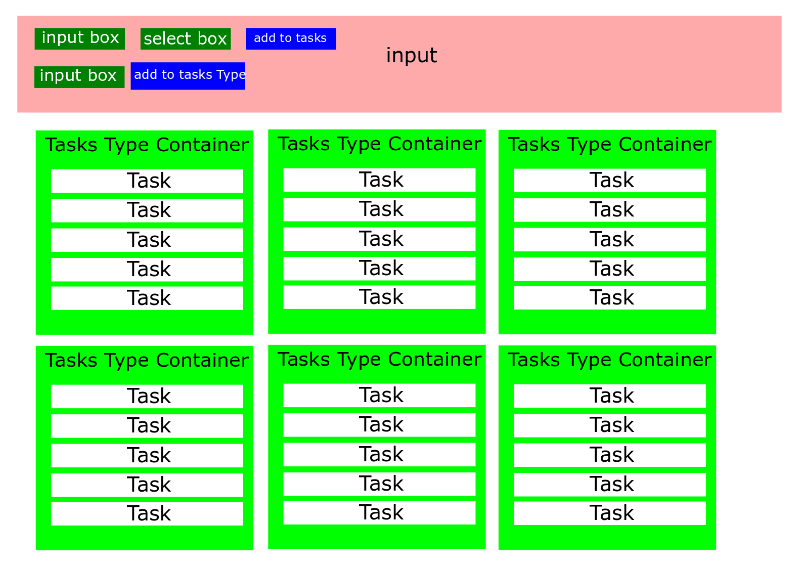

# Day 2 Project - A slimmed down version of trello

If you've never been on [trello](www.trello.com) check it out before we start. Trello is a whiteboarding software that let's you break down bigger tasks into smaller tasks. That is what we're going to do. 

## First, the layout.


There is three main components to this app. 
* taskType - The taskType is the component that holds all of it's different tasks inside of it. We can also name the taskType (Task Type Container in the this case) 
* task - The task component is where you put your task. A task has a taskName, taskType and, completed variable inside of it.
* input - This is the where you can add a task and a taskType to the app.

Let's create a new app called brello
```js
ng new brello
```

## TASK 1 - Started from the bottom now we here
We are gonna need two different models in this app. One for the all of the different taskTypes and one for the tasks themselves. If I know what data I'm gonna be passing, I'll start with the models first so I can get them out of the way. Make the models in a `shared` folder in app.

* Task - should have three parameters: `taskType:string`, `taskName: string` and `completed: boolean`.
* TaskType - should have two parameters: `name:string` and `task: Task[]`

<details>
<summary>Detailed Instructions</summary>

1. Create a new folder called `shared` in the `app` folder.
1. Create a new file called `task.model.ts`
1. Create a class called Task and give the constructor three parameters, `taskType: string, taskName: string` and `completed: boolean`. Make all of them public so we can use it's variable later on.
1. Create a new file called `taskTypes.model.ts` in the `shared` folder.
1. import Task from `./task.model`
1. Make a class called TaskType and give it two parameters, `name: string `and` task: Task[]`. We are going to hold the name of the TaskType and an array of `Task`. Make these also public.
</details>

<details>
<summary>Solutions</summary>

<details>
<summary><code>task.model.ts</code></summary>

```js
export class Task {
  constructor(public taskType: string, public taskName: string, public completed: boolean) {}
}
```
</details>

<details>
<summary><code>taskType.model.ts</code></summary>

```js
import { Task } from './task.model';

export class TaskType {
  constructor(public name: string, public tasks: Task[]) {}
}

```
</details>


</details>

## TASK 2 
Let's make an input component. We need an input to make a new task and make a new taskType.

* task input - needs to have an input, a select box (to select which taskType it goes to) and, a button so we can add the task to the taskType.
* taskType input - needs to have an input and a button so we can add the task to the taskType.

<details>
<summary>Detailed Instructions</summary>

1. Create a new component with `ng g c input`
1. Create an input with a local reference called `#task`

<details>

```js
<input type="text" #task>
```
</details>
3. Make a select box and give it a local reference called `#taskSelect`

<details>

```js
<select #taskSelect>
</select>
```
</details>
4. Make a button with a click event that goes to the function `onAddTask` and passes `task` and `taskSelect` as arguments.

<details>

```js
<button (click)="onAddTask(task,taskSelect)">Add Task</button>
```
</details>
5. Add another input box for the taskType and give it a local reference to `#taskType`.

<details>

```js
<input type="text" #taskType>
```
</details>
6. Add a button with a click event that goes to the function `onAddTaskType` that passed `taskType` as a argument.

<details>

```js
<button (click)="onAddTaskType(taskType)">Add Task Type</button>
```
</details>

</details>

<details>
<summary>Solutions</summary>

<details>
<summary><code>input.component.html</code></summary>

```js
<input type="text" #task>

<select #taskSelect>
  <option
  *ngFor="let type of taskTypeDisplay" [value]="type.name">
  {{ type.name }}</option>
</select>

<button (click)="onAddTask(task,taskSelect)">Add Task</button>
<hr>

<input type="text" #taskType>
<button (click)="onAddTaskType(taskType)">Add Task Type</button>
```
</details>
</details>

## TASK 3
Ok we got the input up but, they don't work. In the `input.component.ts` file create two variables called `task` and `taskType` that are `EventEmitter` that pass the correct object to the app. Then create the functions we made in the `input.component.html` file to emit the correct variables.

* task - `{taskType: string, taskName: string, completed: boolean}`
* taskType - `{taskType: string}`

<details>
<summary>Detailed Instructions</summary>

1. Import `Output` and `EventEmitter` from `@angular/core`
<details>

```js
import { Component, OnInit, Input, EventEmitter, Output } from '@angular/core';
```
</details>

2. Make a `task` variable that is an `@Output` and is an `EventEmitter` with the object `{taskType: string, taskName: string, completed: boolean}`.

<details>

```js
@Output() task = new EventEmitter<{taskType: string, taskName: string, completed: boolean}> ();
```
</details>

3. Make a `taskType` variable that is an `@Output` and is an `EventEmitter` with the object `{taskType: string}`.
<details>

```js
@Output() taskType = new EventEmitter<{taskType: string}>();
```
</details>

4. Create the `onAddTaskType` function that takes in `taskType` and then emits it's value.
<details>

```js
onAddTaskType(taskType: HTMLInputElement) {
  this.taskType.emit({ taskType: taskType.value });
}
```
</details>
5. Create the `onAddTask` function that takes in `task` and `taskType` and emits their values and set `completed` to false.
<details>

```js
onAddTask(task: HTMLInputElement, taskType: HTMLInputElement) {
  this.task.emit({ taskType: taskType.value, 
                  taskName: task.value, 
                  completed: false });
}
```
</details>
</details>

<details>
<summary>Solutions</summary>

<details>
<summary><code>input.component.ts</code></summary>

```js
import { Component, OnInit, EventEmitter, Output } from '@angular/core';

@Component({
  selector: 'app-input',
  templateUrl: './input.component.html',
  styleUrls: ['./input.component.css']
})
export class InputComponent implements OnInit {
  @Output() task = new EventEmitter<{taskType: string, taskName: string, completed: boolean}> ();
  @Output() taskType = new EventEmitter<{taskType: string}>();

  constructor() { }

  ngOnInit() {
  }

  onAddTaskType(taskType: HTMLInputElement) {
    this.taskType.emit({taskType: taskType.value});
  }

  onAddTask(task: HTMLInputElement, taskType: HTMLInputElement) {
    this.task.emit ({taskType: taskType.value, taskName: task.value, completed: false });
  }


}
```
</details>

</details>

## TASK 4
Now that we have the buttons emitting the variable we need to get the `app` component to recieve them.

Create a new component called `task-types`. Give it an `h2` tag that displays the `name`. Put that inside a div called `typeDiv` 

Put the `app-input` into the into the `app.component.html` file and give it the event bindings we created. They should point to `addTask` and `addTaskType`.

In the `app.component.ts` file add a `taskType` variable in `app` that is a type of `taskType[]`. Set it inital equal to `[]`.

Add two functions called `addTaskType` and `addTask`. `addTaskType` should add the `taskType` to the `taskType` variable. Give the starting tasks of the taskType to an empty array. 

`addTask` should find which index in the `taskType` array has the `name` that is assosiated with the given task then, add that task the the `taskType`.

<details>
<summary>Detailed Instructions</summary>

1. Create a new component called `task-types`.

```js
ng g c task-types
```
2. In the `task-types.component.html` file, add a div with a class of `typeDiv`. Inside of the div create an `h2` tag that displays the `taskType.name`.

```js
<div class="typeDiv">
  <h2>{{ taskType.name }}</h2>
</div>
```

3. In the `app.component.html` file, add the `app-input` to the top of the file. Give it event bindings of `taskType` and `task` and and have the point to `addTaskType` and `addTask` respectively.

```js
<div>
  <app-input
  (taskType) = "addTaskType($event)"
  (task) = "addTask($event)"></app-input>
</div>
```
4.Import `Task` and `TaskType` from their respective models.

```js
import { Task } from './shared/task.model';
import { TaskType } from './shared/taskType.model';
```

5. In the `app.component.ts` file, create a new variable called `taskTypes` with a type of `TaskType[]` and set it equal to an empty array.

```js
  taskTypes: TaskType[] = [];
```

6. Create the `addTaskType` function. It takes an event as an arguement. Push a `new TaskType(event.taskType,[])` into the `taskTypes` variable.

```js
   addTaskType(event) {
    this.taskTypes.push(
      new TaskType(event.taskType, [])
    );
  }
```

7. Create the `addTask` function. It takes in an event just like `addTaskType`. Find which index in the `taskTypes` array has the assosiated `taskType` in the event. Then push the new `Task` into that index of `taskTypes`

```js
  addTask(event) {
    const index = this.taskTypes.findIndex(e => e.name === event.taskType);

    this.taskTypes[index].tasks.push(new Task(event.typeTask, event.taskName, event.completed));
  }
```

</details>

<details>
<summary>Solutions</summary>

<details>
<summary><code>task-type.component.html</code></summary>

```js
<div class="typeDiv">
  <h2>{{ taskType.name }}</h2>
</div>
```
</details>

<details>
<summary><code>app.component.html</code></summary>

```js
<div>
  <app-input
  (taskType) = "addTaskType($event)"
  (task) = "addTask($event)"></app-input>
</div>
```
</details>

<details>
<summary><code>app.component.ts</code></summary>

```js
import { Component } from '@angular/core';
import { Task } from './shared/task.model';
import { TaskType } from './shared/taskType.model';

@Component({
  selector: 'app-root',
  templateUrl: './app.component.html',
  styleUrls: ['./app.component.css']
})
export class AppComponent {
  taskTypes: TaskType[] = [];


  addTaskType(event) {
    this.taskTypes.push(
      new TaskType(event.taskType, [])
    );
    console.log(this.taskTypes);
  }

  addTask(event) {
    const index = this.taskTypes.findIndex(e => e.name === event.taskType);

    this.taskTypes[index].tasks.push(new Task(event.typeTask, event.taskName, event.completed));
  }
}
```
</details>

</details>